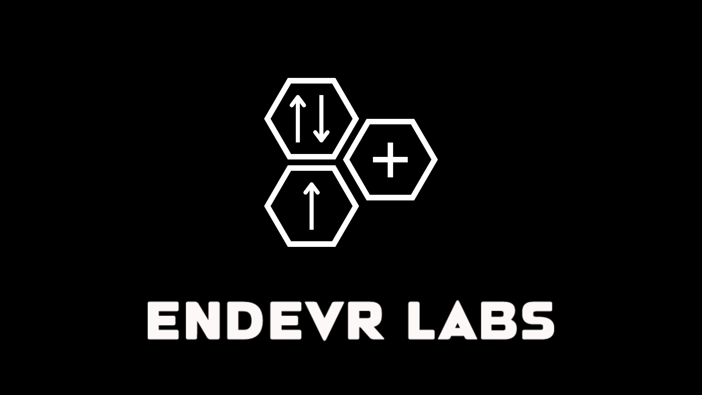

<h1 align="center">👋 Welcome to Endevr Labs</h1>

  

  <b>Endevr Labs</b> is a student-led <b>robotics research and innovation team</b> from <b>Gumaca National High School</b>. 
  We focus on discovering creative solutions through science and technology — designing, building, and researching 
  robots that inspire learning, curiosity, and collaboration in our school community.

---

<h2 align="center">🔧 What We Do</h2>

  We explore. We design. We build. 
  At <b>Endevr Labs</b>, curiosity drives everything we do — from research and design to real-world applications. 
  We build robots for competitions, conduct robotics-related research, and develop tools that make innovation 
  more accessible to students and aspiring engineers.

---

<h2 align="center">🚀 Future Plans</h2>

  Our vision goes beyond building robots — we aim to create open, meaningful projects that support learning 
  and growth in robotics and technology.

<h3 align="center">⚙️ Pioneer</h3>

  <i>An easy-to-use Arduino library designed to simplify robotics programming for students and beginners.</i>  
  <b>Pioneer</b> will help make robotics projects easier to code by offering beginner-friendly functions for motors, 
  sensors, and basic automation. It’s designed to help students focus more on creativity and experimentation, 
  and less on complex technical setup.

<h3 align="center">🤖 Orion Arsenal</h3>

  <i>A collection of student-built robots created for school and inter-school robotics tournaments.</i>  
  <b>Orion Arsenal</b> showcases our lineup of <b>tournament-ready robotics projects</b> — including <b>line tracers</b>, <b>sumobots</b>, 
  and prototype designs. Each robot is carefully developed through teamwork, experimentation, and continuous learning, 
  representing Gumaca National High School in various robotics events.

<h3 align="center">🔬 Robotics Research</h3>

  We explore innovative concepts that connect engineering, automation, and artificial intelligence. 
  Our goal is to create research projects that encourage curiosity and help students understand how technology 
  can solve real-world problems.

---

<h2 align="center">🌐 Links</h2>

  🌎 <b>Website:</b> (Coming Soon!)  
  🧾 <b>Documentation:</b> (Coming Soon!)  
  💬 <b>Join us on Discord:</b> (Coming Soon!)

---

  🧠 <i>“Endeavor beyond limits — innovation starts with curiosity.”</i>

